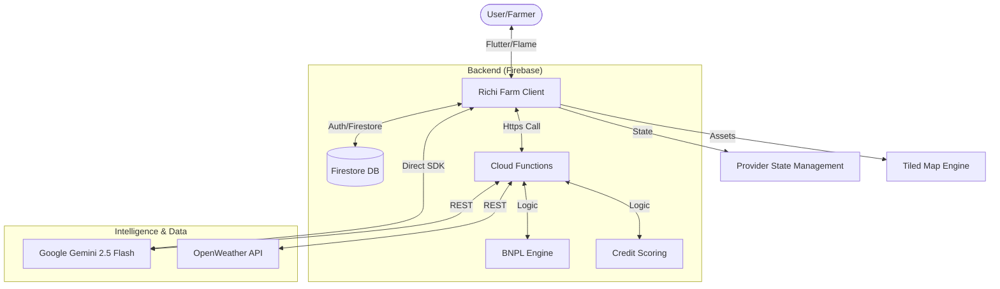

<p align="center">
  
</p>

<h1 align="center">Richi Farm: Chronicles of Wealth</h1>

<p align="center">
  <b>An immersive ASEAN farming simulation empowering financial literacy through AI-driven coaching and real-world fintech integration.</b>
</p>

<p align="center">
  
  
  
  
  
</p>

---

Deployment Link: https://borneo-hackhathon-richi.web.app/


## 🏆 BorneoHack 2026 Finals Submission

**Richi Farm: Chronicles of Wealth** is the final evolution of our immersive fintech-educational game. Designed specifically for the ASEAN region, it bridges the gap between traditional farming simulations and modern financial services like BNPL, micro-loans, and crop insurance.

### 📖 Project Overview
Players step into the shoes of an ASEAN farmer, managing a plot of land across 6 localized countries (**MY, ID, SG, TH, PH, VN**). The core loop involves planting, harvesting, and selling crops (Wheat, Paddy, Corn) while navigating a complex financial landscape. 

The game’s primary goal is **Strategic Wealth Creation**. Players must balance cash flow with credit health, choosing between immediate expansion via **Buy Now, Pay Later (BNPL)** or long-term stability through bank savings and insurance.

---

## ✨ What's New (Finals Edition)

Since the preliminary round, we have significantly deepended the technical complexity and player immersion:

1.  🤖 **Gemini 2.5 Flash Integration (Lyra the Oracle)**:
    -   **Financial Trust Score**: A real-time analysis of the player's financial behavior (debts, credit score, cash-on-hand) that determines the Oracle's guidance and quest difficulty.
    -   **Context-Aware Chat**: Lyra now retains conversation history and adapts her snarky, extroverted persona to the player's specific regional context.
    -   **Dynamic Quest Engine**: Quests are no longer static; they are procedurally generated by Gemini based on active disasters and player progress.

2.  🌩️ **Live Disaster Engine (OpenWeather API)**:
    -   Integrated real-time weather data from OpenWeather API via Firebase Cloud Functions.
    -   Disasters like **Floods, Storms, and Droughts** are triggered by actual weather patterns in the player's selected ASEAN region, affecting crop yields and market prices.

3.  🏦 **Robust Fintech Backend**:
    -   **Server-Side BNPL**: Secure installment tracking, penalty calculations, and credit score updates handled entirely via Cloud Functions to prevent client-side manipulation.
    -   **Credit Scoring System**: A sophisticated model that recalculates scores based on transaction frequency, repayment consistency, and total net worth.

4.  🌲 **World Expansion**:
    -   **The Wild Forest**: A new exploration area where players meet the Oracle and Mysterious Traders.
    -   **House Interior**: A dedicated personal space for the farmer, built with a custom Tiled-based interior engine.

5.  🎨 **High-Performance Isometric Engine**:
    -   Built on the **Flame Engine** with **Tiled** integration.
    -   Features dynamic weather overlays (thunderstorms, rain), a night/day cycle, and smooth joystick-based navigation.

---

## 🛠️ Tech Stack

-   **Frontend**: [Flutter](https://flutter.dev/) with [Flame Engine](https://flame-engine.org/) (2D Game Engine)
-   **Tiled**: Map creation and object layering (`.tmx`)
-   **Backend**: [Firebase](https://firebase.google.com/) (Auth, Firestore, Cloud Functions)
-   **Intelligence**: [Google Gemini 2.5 Flash API](https://ai.google.dev/) (NPC Dialogue, Quest Gen, Financial Analysis)
-   **External Data**: [OpenWeather API](https://openweathermap.org/api) (Regional Disaster Triggers)
-   **State Management**: [Provider](https://pub.dev/packages/provider)

---

## 🚀 Setup Instructions

### Prerequisites
- [Flutter SDK](https://docs.flutter.dev/get-started/install) (Latest Stable)
- [Firebase CLI](https://firebase.google.com/docs/cli)
- [Node.js](https://nodejs.org/) (for Cloud Functions)

### Installation

1.  **Clone the Repository**
    ```bash
    git clone https://github.com/Clarence000000/borneo-hackwknd-mobile-game.git
    cd borneo-hackwknd-mobile-game
    ```

2.  **Environment Setup**
    Create a `.env.local` file in the root:
    ```text
    GEMINI_API_KEY=your_gemini_key
    OPENWEATHER_API_KEY=your_weather_key
    ```

3.  **Install Dependencies**
    ```bash
    flutter pub get
    cd cloud_functions && npm install && npm run build
    ```

4.  **Run the Game**
    ```bash
    flutter run
    ```

---

## 🏗️ Architecture



---

## 🤖 AI Disclosure Statement

-   **AI Tools Used**: Google Gemini 2.5 Flash, GitHub Copilot (for boilerplate efficiency).
-   **AI-Generated Components**:
    -   **Dialogue & Lore**: All interactions with Lyra and the Financial Advisor are generated in real-time.
    -   **Quest Logic**: Titles, descriptions, and reward balancing are generated by Gemini based on the current game state.
-   **Custom Engineering**:
    -   **Structured JSON Parsing**: We engineered specific prompts to ensure Gemini returns valid JSON for quest injection into the game engine.
    -   **Contextual Monitoring**: A hybrid system that feeds hardcoded financial metrics (debt ratios, credit scores) into Gemini for qualitative "Danger Assessments."

---

## 🌏 ASEAN Relevance & SDG Alignment

Richi Farm addresses the **underbanked** population of Southeast Asia by gamifying digital financial products (BNPL, Micro-loans). 
-   **SDG 4 (Quality Education)**: Focus on financial literacy.
-   **SDG 8 (Decent Work & Economic Growth)**: Teaching credit resilience for small-scale entrepreneurs.
-   **ASEAN Focus**: Includes 6 countries with localized currencies and regional crops like Paddy, reflecting the daily economic realities of the region.

---

## 📈 Roadmap
-   **Micro-Investing**: A simulated stock market based on real ASEAN indices.
-   **Multiplayer Cooperatives**: Allowing players to pool funds for community insurance.
-   **Expanded World**: More interactable buildings and NPC storylines.

---

## Admin Test Account
- **Email**: `admin@farmfintech.test`
- **Password**: Any (must register first if not exists)
- **Privileges**: Unlimited cash/bank balance, max credit score, unlocked tutorial.

---
<p align="center">
  Built with ❤️ for BorneoHack 2026 Finals
</p>
