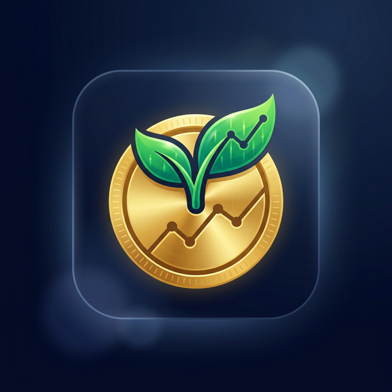

<p align="center">
  
</p>

<h1 align="center">Richi Farm</h1>

<p align="center">
  <b>A premium mobile game empowering financial literacy through immersive farming simulation.</b>
</p>

<p align="center">
  
  
  
  
  
</p>

---
## Report Link
(https://drive.google.com/drive/folders/1aIHVA0aeb2QwFmt8FF7c-_yo1ECLOZ5_?usp=drive_link)

## 📖 Project Description

**Richi Farm** is an innovative mobile game designed for the BorneoHack Hackathon. It merges the addictive loop of an isometric farming simulator with real-world financial education. Players take on the role of a farmer in the ASEAN region, managing a farm while navigating complex financial instruments.

The game isn't just about growing crops; it's about **Strategic Financial Management**. Players must decide between using cash, taking bank loans, or utilizing **Buy Now, Pay Later (BNPL)** schemes to expand their operations. With real-time weather disasters driven by live APIs and AI-powered financial coaching, Richi Farm teaches users the consequences of credit scores, interest rates, and insurance in a safe, gamified environment.

### Key Features
- 🚜 **Custom Isometric Engine**: A smooth, hand-crafted rendering engine for managing your farm.
- 💰 **Fintech Simulation**: Realistic BNPL, loan evaluation, and insurance payout mechanics.
- 🌪️ **Real-World Weather**: Dynamic disaster triggers based on real-time weather data from ASEAN regions.
- 🤖 **AI Financial Advisor**: Personalized financial coaching powered by Google Gemini to help players optimize their net worth.
- 📈 **ASEAN Leaderboard**: Compete with other farmers across Southeast Asia based on your financial health and farm progress.
- 💾 **Cloud Persistence**: Securely save your farm and financial state to Firestore.

---

## 🛠️ Tech Stack

- **Frontend**: [Flutter](https://flutter.dev/) (Cross-platform mobile framework)
- **Language**: [Dart](https://dart.dev/) & [TypeScript](https://www.typescriptlang.org/) (for Cloud Functions)
- **Backend/Database**: [Firebase](https://firebase.google.com/) (Authentication, Firestore, Cloud Functions)
- **Intelligence**: [Google Gemini AI API](https://ai.google.dev/) (Personalized financial warnings and coaching)
- **External Data**: [OpenWeather API](https://openweathermap.org/api) (Simulating disasters based on real regional weather)

---

## 🔗 Quick Links

> [!IMPORTANT]
> **[Download Android APK](https://drive.google.com/drive/folders/1mW611leOgu5TBZUdkg65KFA_vdDSqnxG?usp=sharing)**

---

## 🚀 Setup Instructions

### Prerequisites
- [Flutter SDK](https://docs.flutter.dev/get-started/install) (Latest Stable)
- [Node.js](https://nodejs.org/) (for Cloud Functions deployment)
- [Firebase CLI](https://firebase.google.com/docs/cli)

### Installation & Local Run

1. **Clone the repository**
   ```bash
   git clone https://github.com/Clarence000000/borneo-hackwknd-mobile-game.git
   cd borneo-hackwknd-mobile-game
   ```

2. **Setup Environment Variables**
   Create a `.env.local` file in the root directory and add your keys:
   ```text
   OPENWEATHER_API_KEY=your_key_here
   GEMINI_API_KEY=your_key_here
   ```

3. **Install Flutter Dependencies**
   ```bash
   flutter pub get
   ```

4. **Setup Cloud Functions (Optional for local UI testing)**
   ```bash
   cd cloud_functions
   npm install
   npm run build
   ```

5. **Run the App**
   Connect your device and run:
   ```bash
   flutter run
   ```

---

<p align="center">
  Built with ❤️ for BorneoHack 2026
</p>
